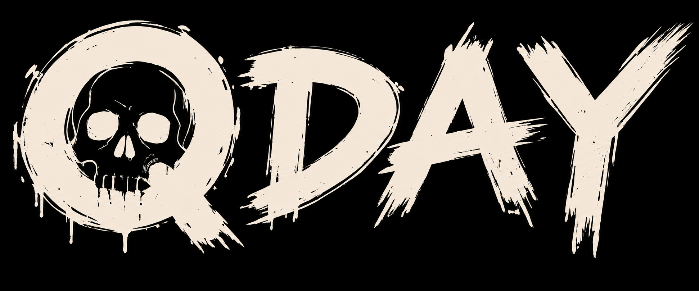

# ☠️ QDAY ☠️
# The PoW Coin Waiting for Its Own Funeral ☠️

**I launched an anti-post-quantum proof-of-work coin with one job: stay alive
until the day its own classical cryptography dies. Most chains would call that
an emergency. QDAY calls it the fucking afterparty.**


> PQ day is inevitable. You're celebrating it with me.

**[$QDAY](https://x.com/search?q=%24QDAY&src=cashtag_click) is live. Mine it
before the funeral.**

---

## 🔥 What This Beautiful Disaster Is

QDAY is a standalone Layer 1. Its own genesis. Its own peer network. Its own
UTXOs. Its own BLAKE2b proof of work. No token contract hiding on somebody
else's chain.

The network begins in familiar territory: miners hash blocks, wallets move
coins and an Edwards25519 challenge sits in public waiting for somebody to
break it. The protocol does not read headlines, trust an oracle or wait for me
to press a dramatic red button. It waits for one mathematical proof.

Then this happens:

```text
BLAKE2b mining
      ↓
somebody recovers the challenge scalar
      ↓
the solution enters the mempool and miners confirm it
      ↓
six-block countdown
      ↓
QDAY: balances display ×1,000,000 and every coin enters defend-or-decay mode
```

Stupid on purpose. Deterministic in consensus. No committee required.

---

## 🪦 Before QDAY

- **Blocks target 60 seconds.** Difficulty adjusts after every block.
- **Mining is BLAKE2b-256.** The wallet includes a native CPU miner.
- **The reward is 8 QDAY plus fees.** Mining rewards wait 60 blocks before
  they can be spent.
- **One displayed QDAY is `10^24` atomic units.** Atomic units are the integers
  actually stored by consensus.
- **Every spend already needs two signatures.** Ed25519 is the classical key;
  SLH-DSA-SHA2-128s is the hash-based reserve key waiting for the wreckage.
- **The challenge is fixed forever.** It is an Edwards25519 point whose secret
  scalar was never chosen or stored by the protocol.

This is the calm part. Mine coins. Move coins. Stare at the canary. Pretend the
future is somebody else's problem.

---

## 💥 What Actually Triggers QDAY

The public challenge is a point `C`. The winning solution is a nonzero scalar
`x` satisfying:

```text
x · G = C
```

The first solver opens **Survival**, pastes the 32-byte solution and verifies it
locally. Publishing it builds a signed transaction, pays a 1 QDAY fee, places
the proof in the ordinary mempool and broadcasts it to peers. Miners include it
like any other transaction.

If the proof lands in block `h`, the network schedules QDAY for block `h + 6`.
A chain reorganization that removes the proof also removes the countdown. The
selected chain decides. Math decides. That's the whole fucking oracle.

Challenge point:

```text
7343aaaab7bb999347740b9e1932f5487046f56b1566ab23cac0b129adefb771
```

The QDAY canary is a reproducible NUMS point. No secret scalar is used anywhere
in its construction. Anyone can verify that generating this point did not
reveal its discrete logarithm.

Reproduce the derivation and compare the result with the mainnet manifest:

```bash
go run ./core/cmd/qday-canary -manifest ./qday-mainnet.json
```

The command derives the challenge above and finishes with `match: true`. The
complete algorithm, transcript and test vectors are in
[`docs/canary.md`](docs/canary.md).

---

## 🥂 After QDAY

At the QDAY block, one displayed QDAY changes from `10^24` atomic units to
`10^18`. Every unchanged atomic balance is displayed as **1,000,000 times as
many QDAY**.

No atomic units appear. The decimal denomination changes. Yes, the number goes
completely feral anyway.

Now ownership becomes a recurring job:

1. **Shield** — A new output keeps its full spendable value for 1,440 blocks,
   about 24 hours at the target interval.
2. **Decay** — After the shield, spendable value falls in 60-block steps over
   10,080 blocks, about seven more days.
3. **Death** — An output that nobody renews reaches zero spendable value about
   eight days after its shield clock began. Lost value never comes back.
4. **DEFEND** — Spending creates new outputs with new shields. Sending the
   surviving value back to yourself is a renewal.

Every post-QDAY spend also needs transaction-bound BLAKE2b work with 20 leading
zero bits: about 1,048,576 hashes on average. The work is tied to the exact
transaction and network, so it cannot be farmed once and pasted everywhere.

Keep the wallet unlocked with **DEFEND** running and it starts renewing outputs
during the final 360 blocks of their shields. The same worker continues mining
blocks. Turn it off and the countdown keeps moving because the chain gives zero
shits about your alarm clock.

---

## 🔥 Yes, There is a Premine, but

I said “no. or maybe.” Here is the answer in the chain where it belongs:

```text
500,000 QDAY
qday1pdsa0ezy7y3nnmnxm0tx74q2kd9acvzs8329wfd2n6ycqnmygtt9stpwtsr
```

Then BLAKE2b crossed kH/s, MH/s, GH/s and TH/s. Fine. The premine found a job.

Every time stable network hashrate earns a new SI prefix, I burn 10% of whatever
premine is left.

| Prefix | Burn |
| --- | ---: |
| KILO, kH/s | 50,000 QDAY |
| MEGA, MH/s | 45,000 QDAY |
| GIGA, GH/s | 40,500 QDAY |
| TERA, TH/s | 36,450 QDAY |
| PETA, PH/s | 32,805 QDAY next |

**171,950 QDAY is permanently dead.** The premine address now holds exactly
**328,049.998 QDAY**: 328,050 after the burns, minus the two 0.001 QDAY
transaction fees that put them on-chain.

[View the latest burn transaction](https://explorer.pqday.com/transaction/583d8e57be36a8ad694e401a51775339dba40002d68334ee3139830be8824089).
Make the number bigger. Make my premine smaller.

The genesis allocation was about **5.88%** of the maximum 8,500,000 QDAY issued
by genesis and the first 1,000,000 block rewards. The remaining address balance
is about **3.86%** of that maximum. There was no presale and no VC allocation
hidden behind a prettier word.

The issuance cap remains 8,500,000 QDAY. Confirmed burns reduce current supply,
so after these burns no more than 8,328,050 QDAY can remain when block rewards end,
before any later burns or decay. After PQ Day that amount displays as
8,328,050,000,000 QDAY. The multiplier is a unit change. Nothing is printed.

---

## 🚀 Quick Start for the Impatient

Download the archive for your Linux, Windows or macOS machine and its `.sha256` file from this
repository's Releases page. Extract the **entire** archive before opening the
wallet. The executable needs the bundled `resources` directory beside it.

### Linux

```bash
sha256sum -c QDAY-Wallet-0.8.0-mainnet-linux-amd64.tar.gz.sha256
tar -xzf QDAY-Wallet-0.8.0-mainnet-linux-amd64.tar.gz
cd QDAY-Wallet-0.8.0-mainnet-linux-amd64
./QDAY-Wallet
```

### Windows

Verify the ZIP in PowerShell and compare the result with the downloaded
`.sha256` file:

```powershell
Get-FileHash .\QDAY-Wallet-0.8.0-mainnet-windows-amd64.zip -Algorithm SHA256
```

Extract the ZIP, then open `QDAY-Wallet.exe`. The Windows executable is
currently unsigned, so Windows may show a publisher warning. Verify the hash
and get the archive from this repository. Random binaries in DMs are how you
turn a wallet into somebody else's wallet.

### macOS

Use `macos-arm64` on Apple Silicon and `macos-amd64` on Intel:

```bash
shasum -a 256 -c QDAY-Wallet-0.8.0-mainnet-macos-arm64.tar.gz.sha256
tar -xzf QDAY-Wallet-0.8.0-mainnet-macos-arm64.tar.gz
cd QDAY-Wallet-0.8.0-mainnet-macos-arm64
./QDAY-Wallet
```

The first macOS release is unsigned. Verify the hash before opening it; macOS
may require **Open Anyway** in Privacy & Security for both bundled executables.

### First run

1. Create a wallet or import an existing QDAY seed phrase.
2. Save the 24 words somewhere that does not disappear with the laptop.
3. Choose a local passphrase with at least 12 characters.
4. Wait until the node is synchronized.
5. Open **CPU mining**, choose the thread count and press **MINE**.

The interface opens in your browser, but the node and miner are native code.
Closing the tab leaves QDAY running. Open the executable again to reopen it.
Use **EXIT QDAY** in the top-right corner to stop the complete application.

Wallet and chain data live in `%APPDATA%\qday` on Windows,
`~/.config/qday` on Linux and `~/Library/Application Support/qday` on macOS
unless the operating system overrides its standard config directory.

---

## 🖥️ Run the Node Without the Wallet Window

Every release also includes a smaller `QDAY-Node` archive for each supported
platform. It contains the same node binary bundled with the graphical wallet,
the fixed mainnet manifest, deployment files and public protocol docs.

```bash
tar -xzf QDAY-Node-0.8.0-mainnet-linux-amd64.tar.gz
cd QDAY-Node-0.8.0-mainnet-linux-amd64
./qday --network ./qday-mainnet.json
```

The ordinary node listens on TCP `19771`, exposes its authenticated API only
on `127.0.0.1:19770` and discovers the network through the three bootstrap
servers. Run `./qday --help` for data-directory, manual-peer, UPnP and seed
node options. Operators building pools, explorers or exchange infrastructure
should start with [`docs/integrations.md`](docs/integrations.md).

---

## ⛏️ Mining Without the Ceremony

The bundled CPU miner is there so a new wallet can participate immediately.
The initial target takes about 1,048,575 hashes per block on average across the
whole network. Your own result depends on your share of total hash rate and on
luck. A 60-second target is a network average, not a promise that your laptop
gets paid every minute.

QDAY does not pretend to be ASIC-resistant. BLAKE2b hardware can participate.
The node provides authenticated `getblocktemplate` and `submitblock` endpoints
that build candidates from the QDAY mempool. A pool can reuse the raw 80-byte
BLAKE2b search while the node handles QDAY's marker, transaction validation,
fees and commitment. The separate
[`qday-stratum`](https://github.com/petoshi/qday-stratum) bridge connects
SiaMining-compatible GPU or ASIC software directly to a local QDAY wallet.
Pool details live in
[`docs/integrations.md`](docs/integrations.md).

The three bootstrap servers help wallets find the network. They do not mine.

---

## 🔐 Your Wallet, Your Problem

One QDAY seed phrase contains 24 English words and deterministically restores:

- one Ed25519 private key;
- one SLH-DSA-SHA2-128s private key;
- one 64-character `qday1p...` address.

The bundled wallet has one address per seed phrase. It is not an HD account
tree. The wallet passphrase encrypts the seed on this computer; it does not
change the address and it cannot replace the 24 words. If you forget the local
passphrase, import the seed phrase from the locked screen and choose a new one.

**Import replaces the local wallet without keeping a backup.** Save the current
seed phrase first if its coins still matter to you.

Locking the wallet stops mining and DEFEND, clears the loaded private keys and
covers the interface with the unlock screen. The blockchain node may stay
online while the keys are locked.

---

## ⚙️ Mainnet Numbers That Matter

| Parameter | Mainnet value |
| --- | --- |
| Mainnet start | `2026-09-11T06:59:00Z` |
| Genesis ID | `d71aebcb687c2fca4d3a5819e6c632efa7d46731395970fce081f3dc57606a40` |
| Manifest SHA-256 | `14d4a47a850f5ba9d81129142d8718c323d826b5f9459516374c4f0f92eaa65b` |
| Proof of work | BLAKE2b-256 over an 80-byte header |
| Target block interval | 60 seconds |
| Initial expected work | 1,048,575 hashes |
| Block reward | `8 × 10^24` atomic units plus fees for blocks 1–1,000,000 |
| Premine | `500,000 × 10^24` atomic units |
| Maximum created supply | 8,500,000 QDAY in the original denomination |
| Mining reward maturity | 60 blocks |
| Default wallet fee | 0.001 QDAY before QDAY; 1,000 QDAY after QDAY |
| Challenge-proof fee | 1 QDAY before QDAY |
| QDAY countdown | 6 blocks after proof inclusion |
| Shield / decay | 1,440 blocks / 10,080 blocks |
| DEFEND work | 20 leading zero bits per spend |
| Standalone P2P | TCP `19771` |
| Standalone local API | `127.0.0.1:19770` |

Genesis inscription:

```text
PQ DAY IS INEVITABLE. YOU'RE CELEBRATING IT WITH ME.
```

Bootstrap nodes:

```text
seed1.pqday.com:19771
seed2.pqday.com:19771
seed3.pqday.com:19771
```

The desktop wallet remembers a random free P2P port instead of forcing every
laptop onto 19771. It tries UPnP for inbound reachability. Behind CGNAT or a VPN
without port forwarding, outbound synchronization and transaction relay still
work; other peers usually cannot connect back to you.

---

## 🧬 The Technical Guts

QDAY is built from Sia's core, chain and synchronization code, then split onto
its own genesis and network marker. The pieces worth knowing:

- **Consensus:** BLAKE2b chain work, 60-second target, per-block Oak / Final Cut
  difficulty adjustment and work-based chain selection.
- **Transactions:** coin transfers only, up to 128 inputs and 128 outputs.
- **Authorization:** every input requires Ed25519 and SLH-DSA-SHA2-128s.
- **Isolation:** QDAY peers verify both the QDAY network marker and mainnet
  genesis ID during the handshake.
- **Discovery:** wallets use DNS bootstrap nodes, learn ordinary peers, release
  bootstrap connections and return when their peer set dies.
- **Local API:** authenticated, loopback-only wallet control. It is not an
  exchange or explorer API wearing a fake moustache.
- **Exchange custody:** [`qday-walletd`](https://github.com/petoshi/qday-walletd)
  runs a headless validating node with deterministic deposit addresses and
  idempotent withdrawals.

The exact rules are short enough to read:

- [`docs/parameters.md`](docs/parameters.md) — every fixed mainnet number.
- [`docs/canary.md`](docs/canary.md) — reproducible NUMS derivation and verifier.
- [`docs/consensus.md`](docs/consensus.md) — blocks, signatures, proof, QDAY,
  denomination, shields, decay and DEFEND.
- [`docs/protocol.md`](docs/protocol.md) — P2P, addresses, seed phrase, key file
  and binary transaction header.
- [`docs/api.md`](docs/api.md) — every endpoint exposed by the local wallet.
- [`docs/integrations.md`](docs/integrations.md) — exact differences a Sia pool,
  exchange or explorer must handle.

---

## 🔧 Build It Yourself

The source workspace uses Go 1.26 and CGO for SQLite. Build the node and desktop
launcher:

```bash
make build
./build/qday-wallet --network ./qday-mainnet.json --node ./build/qday
```

Run the checks:

```bash
make test
make race
make smoke
make browser
```

Build release archives for the current native target:

```bash
make dist MANIFEST=qday-mainnet.json TARGETS=linux-amd64
make desktop-test
```

Supported targets are `linux-amd64`, `linux-arm64`, `windows-amd64`,
`macos-amd64` and `macos-arm64`. The release archives contain native
executables, the fixed mainnet manifest, the public docs and dependency
licenses. Each target gets a graphical wallet archive and a standalone node
archive. They never contain a wallet key, seed phrase or API token.

---

## 🚨 Read This Before You Act Surprised

- This is new consensus code. It has not received an independent security
  audit. Read it. Break it. Report what broke.
- The built-in miner uses your CPU and electricity. Choose the thread count
  accordingly.
- A public deterministic genesis lets anyone search first-block nonces before
  the start time. Conforming nodes still reject and refuse to relay the block
  until the configured timestamp.
- A valid challenge proof is permanent once it survives chain
  reorganizations. The denomination and survival rules then come from every
  node, not from an announcement.
- After QDAY, an unattended output eventually decays to zero. That is the
  mechanism, not a support ticket.

---

## 💬 Final Transmission

QDAY does not promise to stop the cryptographic apocalypse. It gives the
apocalypse a block height, multiplies the scoreboard by a million and makes
every owner fight for whatever survives.

Mine today. Witness tomorrow. Defend after midnight.

**Same chaos. Different era.**

https://x.com/_petoshi

https://pqday.com

**petoshi** ☠️
